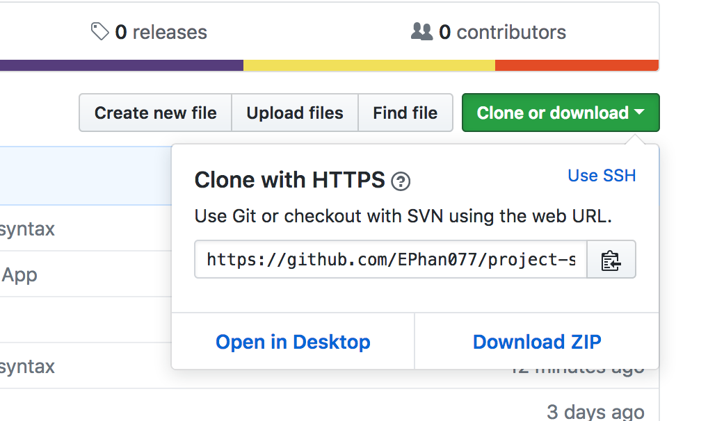

# Project Responsive Image Gallery

This project's purpose is to develop a respnsive image gallery with some type of animation incorporated. The [Unsplash API](https://unsplash.com/developers) was used to retrieve the image gallery of choice. 

## Responsive Images

Implemented the img srcset element technique to appropriately size images based on user viewport size.

## Animation

A hover effect on the gallery images was implemented to show the author and amount of likes. See the example of the animation.

The header also has a couple of effects, one on the globe icon and second on the quote. The globe icon will roll when clicked, and the quote will also change to a different one. Also just for fun, their is an enter page prior to the image gallery that has a friendly little icon!

## Zombies Image Gallery

[Zombies Image Gallery](https://ephan077.github.io/project-responsive-image-gallery/). If you'd like to run this locally please clone or download.

